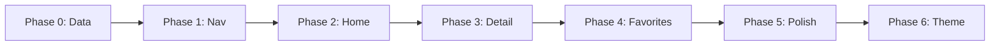

# NaturaLens — Urban Wildlife Tracking Redesign

Design document for aligning the NaturaLens mobile app with the **Urban Wildlife Tracking App** visual and structural direction (Dribbble reference). This covers a full redesign: 5-tab navigation, discovery feed home, species detail screen, favorites, and a calm, nature-inspired aesthetic.

---

## 1. Design Reference (Dribbble)

**Source:** Urban Wildlife Tracking App — clean, modern wildlife tracking for urban exploration, community reporting, and environmental observation.

### Screen 1 — Species Discovery Dashboard (Home)

- **Header:** Greeting "Hi, [Name]" with avatar placeholder and notification bell.
- **Search bar:** Full-width pill, placeholder "Search region, or species...", magnifying glass icon.
- **Category filters:** Horizontal pill chips with icons (e.g. Forest, Ocean, Desert). Selected state: green fill; unselected: light surface.
- **Featured wildlife:** 2-column grid of large photo-dominant cards:
  - Rounded corners, full-bleed image.
  - Heart/favorite icon overlay (top-right).
  - Bottom gradient overlay with species name and location (pin icon).
- **Recent Sightings:** Section title + "See all" link; horizontal scroll of smaller photo cards with heart and name/location.
- **Bottom nav:** 5 tabs — Home (filled), Map, Favorites, Profile, Camera.

### Screen 2 — Species Detail & Sighting Logging

- **Hero image:** Full-width species photo; back and heart icons overlaid; species name + region with pin on image.
- **Content card (scrollable):**
  - **About This Species:** Icon + heading + short description.
  - **Observation Guide:** Icon + heading + guidance text.
  - **Your Observation:** Icon + heading + text input placeholder ("Add notes about behavior, movement, or ...").
- **Bottom action bar:** Camera icon, flag icon, and primary CTA "+ Add New Sighting" (dark pill button).

### Design Characteristics

- **Colors:** White/light gray backgrounds, forest green accents for selected/primary states, dark text.
- **Cards:** Large rounded corners, photo-first, soft gradient overlays; minimal harsh shadows.
- **Typography:** Clear hierarchy, bold headings, readable body.
- **Flow:** Discovery feed first; map and camera as dedicated tabs; species detail for deep-dive and logging.

---

## 2. New 5-Tab Navigation

Remap from current 4-tab structure to match the reference.

| Tab ID     | Label     | Icon (Ionicons)     | Screen           |
|------------|-----------|---------------------|------------------|
| `home`     | Home      | `home` / `home-outline` | HomeScreen       |
| `map`      | Map       | `location` / `location-outline` | ExploreScreen (map) |
| `favorites`| Favorites | `heart` / `heart-outline` | FavoritesScreen  |
| `profile`  | Profile   | `person` / `person-outline` | ProfileScreen    |
| `camera`   | Camera    | `camera` / `camera-outline` | CameraScreen     |

- **TabId type:** `'home' | 'map' | 'favorites' | 'profile' | 'camera'`.
- **Default tab:** `home`.
- **Camera tab:** Can use a distinct style (e.g. filled circle) to match the reference’s camera FAB in the bar.

**Files to update:**

- [apps/mobile/src/contexts/AppStateContext.tsx](apps/mobile/src/contexts/AppStateContext.tsx) — `TabId`, default `activeTab`, optional `favoriteSpeciesIds` + `toggleFavorite`.
- [apps/mobile/src/components/TabBar.tsx](apps/mobile/src/components/TabBar.tsx) — TABS array and icons.
- [apps/mobile/src/layouts/MainLayout.tsx](apps/mobile/src/layouts/MainLayout.tsx) — route `activeTab` to the correct screen; floating actions and results panel only on `camera`.

---

## 3. Data Models

### Species (extended from current collection)

```typescript
export type HabitatId = 'all' | 'forest' | 'ocean' | 'desert' | 'urban' | 'wetland';
export type SpeciesCategory = 'mammal' | 'bird' | 'insect' | 'flora' | 'reptile';

export interface Species {
  id: string;
  label: string;
  category: SpeciesCategory;
  imageUrl: string;
  region: string;           // e.g. "South Africa region"
  habitat: HabitatId;
  description: string;      // "About This Species"
  observationGuide: string;
  isFavorite: boolean;
  sightings?: number;
  lastSeen?: number;
}
```

### Sighting (for Recent Sightings)

```typescript
export interface Sighting {
  id: string;
  speciesId: string;
  imageUrl: string;
  label: string;
  region: string;
  timestamp: number;
}
```

**Files:**

- [apps/mobile/src/types.ts](apps/mobile/src/types.ts) — add `Species`, `Sighting`, `HabitatId`; align `SpeciesCategory` if needed.
- [apps/mobile/src/data/collectionSpecies.ts](apps/mobile/src/data/collectionSpecies.ts) — migrate to `Species` with `region`, `habitat`, `description`, `observationGuide`.
- **New:** `apps/mobile/src/data/recentSightings.ts` — array of `Sighting` for the home "Recent Sightings" row.

---

## 4. Screen-by-Screen Specs

### 4.1 HomeScreen (new)

**File:** `apps/mobile/src/screens/HomeScreen.tsx`

**Layout (ScrollView, top to bottom):**

1. **Greeting header** — "Hi, Explorer" (or placeholder name); notification bell (right). Padding below status bar.
2. **Search bar** — Full-width pill; placeholder "Search region, or species..."; search icon.
3. **Habitat filter chips** — Horizontal scroll; chips: Forest, Ocean, Desert, Urban, Wetland (with icons). Selected: `primary` bg; unselected: `surface` + `textSecondary`.
4. **Featured species** — 2-column grid of large photo cards (`SightingCard`). Each card: image, heart overlay, bottom gradient with name + location; tap → SpeciesDetailScreen.
5. **Recent Sightings** — Section title "Recent Sightings" + "See all" link; horizontal `FlatList` of `RecentSightingCard` (smaller cards).

Use theme tokens from [apps/mobile/src/theme.ts](apps/mobile/src/theme.ts) for spacing, radius, typography, colors.

### 4.2 SpeciesDetailScreen (new)

**File:** `apps/mobile/src/screens/SpeciesDetailScreen.tsx`

**Presentation:** Full-screen overlay/modal when a species is selected (e.g. `selectedSpecies` in app state).

**Layout:**

- **Hero:** Full-width image (~40–45% height). Overlay: back button (top-left), heart (top-right). On image bottom: species name + location (pin). Optional carousel dots if multiple images.
- **Scrollable content (white card, rounded top):**
  - **About This Species** — Icon + `titleSm` heading + `bodySm` description.
  - **Observation Guide** — Icon + heading + guide text.
  - **Your Observation** — Icon + heading + text input (`surfaceMuted` bg, placeholder "Add notes about behavior, movement, or ...").
- **Bottom bar:** Camera icon, flag icon, "+ Add New Sighting" primary button (dark pill).

**Navigation:** `selectedSpecies` / `setSelectedSpecies` in [AppStateContext](apps/mobile/src/contexts/AppStateContext.tsx); MainLayout renders this overlay when `selectedSpecies !== null`.

### 4.3 FavoritesScreen (new)

**File:** `apps/mobile/src/screens/FavoritesScreen.tsx`

- Header: "Favorites" (`titleLg`).
- 2-column grid of `SightingCard` for species where `isFavorite === true` (or id in `favoriteSpeciesIds`).
- Empty state: icon + "No favorites yet" message.

### 4.4 Map tab (existing ExploreScreen)

**File:** [apps/mobile/src/screens/ExploreScreen.tsx](apps/mobile/src/screens/ExploreScreen.tsx)

- No structural change; remains full-screen map with floating search, filter chips, observation card.
- Optional: align overlays and controls with the new visual language.

### 4.5 Camera tab (existing CameraScreen)

**File:** [apps/mobile/src/screens/CameraScreen.tsx](apps/mobile/src/screens/CameraScreen.tsx)

- Keep all capture and detection logic.
- Polish: primary button and loading states to use `primary` (green) and soft shadows; no behavior changes.

### 4.6 ProfileScreen (update)

**File:** [apps/mobile/src/screens/ProfileScreen.tsx](apps/mobile/src/screens/ProfileScreen.tsx)

- Add placeholder name and optional stats row (e.g. sightings count, species count, favorites).
- Keep Settings and About rows; optionally add "My Observations" or similar link.

---

## 5. Component Inventory

| Component | Path | Purpose |
|-----------|------|--------|
| **SightingCard** | `src/components/home/SightingCard.tsx` | Large photo card: image, gradient overlay, name + location, heart. Used in Home and Favorites grids. |
| **RecentSightingCard** | `src/components/home/RecentSightingCard.tsx` | Smaller horizontal card for Recent Sightings list. |
| **HomeSearchBar** | `src/components/home/HomeSearchBar.tsx` | Pill search input; placeholder "Search region, or species...". |
| **HabitatChips** | `src/components/home/HabitatChips.tsx` | Horizontal scroll of habitat filters with icons; active/inactive states. |
| **TabBar** | `src/components/TabBar.tsx` | Update to 5 tabs and new icons; optional special style for Camera tab. |

**Shared:** Use [HarmonyCard](apps/mobile/src/components/ui/HarmonyCard.tsx), [PrimaryButton](apps/mobile/src/components/ui/PrimaryButton.tsx), [SecondaryButton](apps/mobile/src/components/ui/SecondaryButton.tsx) and theme tokens for consistency.

---

## 6. Theme Refinements

**File:** [apps/mobile/src/theme.ts](apps/mobile/src/theme.ts)

- **Colors:** Optionally nudge `bg` toward a cleaner off-white (e.g. `#F7F8FA`) for light mode; keep existing `primary` green and semantic colors.
- **Radius:** Add `radius.xl: 20` for larger cards if needed.
- **Shadows:** Add `shadows.lg` for hero or elevated sections; keep `sm`/`md` for cards and buttons.

No change to [ThemeContext](apps/mobile/src/contexts/ThemeContext.tsx) contract; tokens remain the single source for components.

---

## 7. Files Changed / Created

| Action | File |
|--------|------|
| Modify | `apps/mobile/src/types.ts` |
| Modify | `apps/mobile/src/data/collectionSpecies.ts` |
| Create | `apps/mobile/src/data/recentSightings.ts` |
| Modify | `apps/mobile/src/contexts/AppStateContext.tsx` |
| Modify | `apps/mobile/src/components/TabBar.tsx` |
| Modify | `apps/mobile/src/layouts/MainLayout.tsx` |
| Create | `apps/mobile/src/screens/HomeScreen.tsx` |
| Create | `apps/mobile/src/screens/SpeciesDetailScreen.tsx` |
| Create | `apps/mobile/src/screens/FavoritesScreen.tsx` |
| Create | `apps/mobile/src/components/home/SightingCard.tsx` |
| Create | `apps/mobile/src/components/home/RecentSightingCard.tsx` |
| Create | `apps/mobile/src/components/home/HomeSearchBar.tsx` |
| Create | `apps/mobile/src/components/home/HabitatChips.tsx` |
| Modify | `apps/mobile/src/screens/CameraScreen.tsx` |
| Modify | `apps/mobile/src/screens/ProfileScreen.tsx` |
| Modify | `apps/mobile/src/components/OnboardingOverlay.tsx` (optional CTA alignment) |
| Modify | `apps/mobile/src/theme.ts` |

---

## 8. Implementation Order



1. **Phase 0 — Data layer:** types, `collectionSpecies` migration, `recentSightings.ts`.
2. **Phase 1 — Navigation:** `TabId`, TabBar, MainLayout screen routing and floating UI.
3. **Phase 2 — Home:** HomeScreen, SightingCard, RecentSightingCard, HomeSearchBar, HabitatChips.
4. **Phase 3 — Species detail:** SpeciesDetailScreen, `selectedSpecies` state, overlay in MainLayout.
5. **Phase 4 — Favorites:** FavoritesScreen, optional `favoriteSpeciesIds` / `toggleFavorite` in context.
6. **Phase 5 — Polish:** CameraScreen, ProfileScreen, OnboardingOverlay, ExploreScreen visuals.
7. **Phase 6 — Theme:** `theme.ts` refinements (bg, radius.xl, shadows.lg).

---

## 9. What Stays Unchanged

- **Logic:** Detector ([apps/mobile/src/lib/detector.ts](apps/mobile/src/lib/detector.ts)), map implementations (MapScreen, MapWebView, MapNativeView, MapFallbackView), detection flow.
- **Core UI:** SettingsSheet, ErrorBanner, ResultsPanel — behavior unchanged; only token usage if needed.
- **App entry:** [App.tsx](apps/mobile/App.tsx), font loading, onboarding gate, provider tree.

This document is the single reference for the Urban Wildlife–style redesign of NaturaLens mobile.
